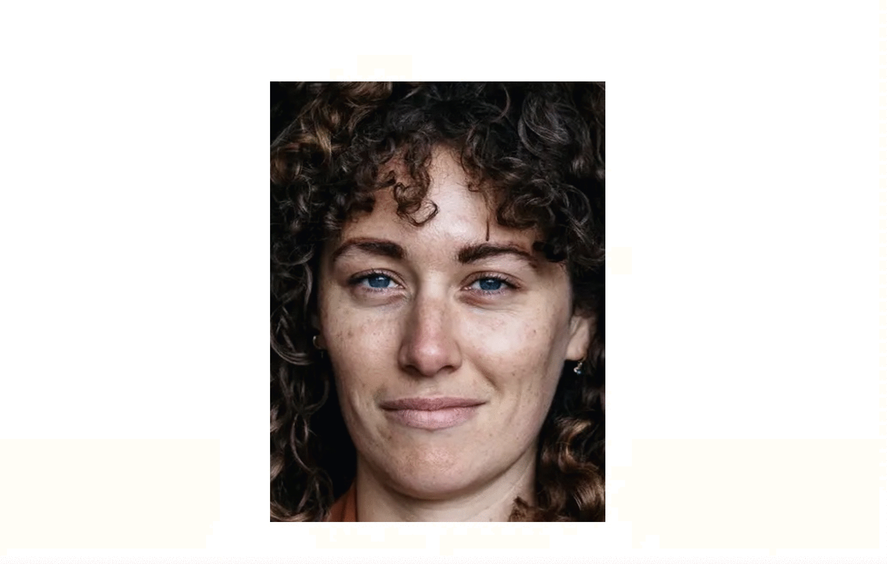
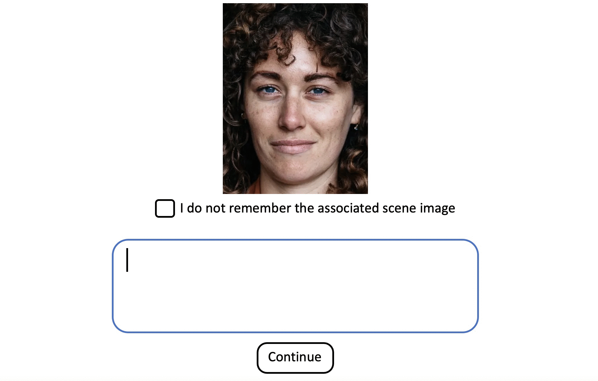

```{r setup, include=FALSE}
library(flexdashboard)
library(tidyverse)
library(effsize)
library(broom)
library(reshape2)
library(data.table)
library(DescTools)
library(wesanderson)
library(magick)

# create gifs from images
source("createGifs.R", local = knitr::knit_global())

```

```{r get data}
all_data <- read.csv('all_data.csv')

source("runModel.R", local = knitr::knit_global())

all_data <- cbind(all_data, embeddings[,1:768])

numSubj = 115

goodSubj = setdiff(seq(1,numSubj), as.integer(c(999)))
badSubj = c("085", "108")

# select only subjects with 100% multiple choice accuracy
goodSubj = setdiff(goodSubj, as.integer(badSubj))

```

Background
======================================================================

When navigating a complex world, we often form memories of similar events. This can lead to interference, or confusion, between similar memories. Recent work has suggested that we may possess adaptive processes that allow us to better discriminate between these similar memories. Specifically, there may be "repulsion" where similar memories are remembered as more different than they actually are. However, those studies were limited to the measurement of one or two features (e.g., color). In this experiment, I seek to measure repulsion in memory for naturalistic scene images using more complex free verbal recall.

Conditions
======================================================================

Overview {.sidebar}
----------------------------------------------------------------------

A total of 36 scene images were chosen (6 categories, each with 6 images). Sixty participants were recruited for a competitive condition, and sixty participants were recruited for a non-competitive condition. Participants in the competitive condition studied six images from a single category. Similarity of features for images in the same category were intended to drive interference, and therefore a potential "repulsion" effect. Meanwhile, participants in the non-competitive condition studied one images from each of the six categories.

Column {.tabset}
-----------------------------------------------------------------------

### Example Competitive Stimuli

```{r competitive stimuli}
knitr::include_graphics("Competitive.png")

```

### Example Non-Competitive Stimuli

```{r non-competitive stimuli}
knitr::include_graphics("NonCompetitive.png")

```

Experimental Design
======================================================================

Overview {.sidebar}
----------------------------------------------------------------------

The experiment begins with a learning task, which composes of (1) a study phase, and (2) a vividness phase.  After six rounds of the learning task, participants complete a recall task where they view each face image cue, and type a description of the associated scene image. 

Column {.tabset}
-----------------------------------------------------------------------

### Study Phase

#### Description 

During the study phase, participants learn pairs of face images (cues) and scene images (associates). Trials begin with a face image (1000ms), followed by a fixation cross (500ms), then a scene image (3000ms), followed by a fixation cross (1000ms).

#### Sample Trial 

```{r study gif}
knitr::include_graphics("study.gif")

```

### Vividness Phase

#### Description

During the vividness phase, participants are presented with each face image cue, and must practice recalling the associated scene image as vividly as possible, and rate the vividness of their memory using a 3-point scale (vivid, weak, or no memory). Trials begin with a face image (1000ms), followed by a fixation cross (500ms). Then a black box is presented (1500ms) as a cue to recall the associated scene image, followed by a red box (1500ms) as a cue to make a keyboard response on vividness of the memory ('j' = vivid, 'l' = weak, 'l' = no memory). The trial ends with a fixation cross (1000ms).

#### Sample Trial

```{r vivid gif}


```

### Recall Task

#### Description

During the recall phase, participants view each face image cue one at a time. They must recall the associated scene image and type a description of the scene image in at least 10 words. If they do not remember the associated scene image, they may check the box to indicate they do not remember.

#### Sample Trial

```{r recall gif}


```

Analysis
======================================================================

Overview {.sidebar}
----------------------------------------------------------------------

To quantify information in verbal descriptions, I will use Natural Language Processing (NLP) algorithms (specifically MPNET). NLP algorithms transform text descriptions into numerical vectors with hundred of dimensions representing semantic content (i.e., text emmbeddings). First, I will consider how many words are used to describe the scene images in the competitive and non-competitive conditions. Then I will consider if there is a difference in what is actually remembered (as measured using NLP text embeddings) between the competitive and non-competitive conditions.

Column {.tabset}
-----------------------------------------------------------------------

### Number of Words 

#### Description

Distribution of number of words used to describe scene images in the competitive and non-competitive conditions.

#### Figure

```{r separate conditions}
# baseline subjects 
baseline <- all_data %>%
  filter(Condition == "Baseline",
         noMemory == 'false')
# competitive subjects 
competitive <- all_data %>%
  filter(Condition == "Competitive",
         noMemory == 'false')

# get average baseline vectors for each image
averageBaselineVectors <- baseline %>%
  group_by(Scene.File, Category) %>%
  summarise_at(vars(`1`:`768`), mean)

```


```{r count num words}
byWords <- all_data %>%
  filter(noMemory == 'false') %>%
  mutate(numWords = str_count(responses, "\\w+"),
         Condition = recode(Condition, "Baseline" = "Non-Competitive")) %>%
  group_by(Condition, subjNum) %>%
  summarize(numWords = mean(numWords))

byWords %>% ggplot() +
  geom_density(aes(x = numWords, fill = Condition), alpha = 0.5) + 
  theme_minimal() +
  scale_fill_manual(values = c("coral2","steelblue2")) +
  scale_x_continuous(breaks = seq(10, 90, by = 10)) +
  labs(x = "Number of Words",
       y = "Density",
       title = "Distribution of Number of Words")

```

### Remembered Information

#### Description

Text embeddings from the competitive and non-competitive conditions are correlated with text embeddings for same-category text embeddings from the non-competitive condition. Lower correlations indicate a "repulsion" effect, where an image is remembered as more different from other same-category images. Indeed, correlations from the competitive condition were significantly lower than the non-competitive condition, indicating a "repulsion" effect when same-category images are studied together, Welch's t(75.31) = 3.87, p < 0.001. 

#### Figure

```{r by subject analysis}
# for each subject
allSubjDF <- {}
for (i in goodSubj){
  # convert to 3 digit number
  curSubject = sprintf("%03d", i)
  # get current subject responses
  curResponses <- all_data %>%
    filter(subjNum == i)
  # for each response compare to baseline of same category images
  subjImsMeanCorVals = {}
  for (j in seq(1,dim(curResponses)[1])){
    # get current image response
    curResponse <- curResponses[j,]
    # select average baseline responses to compare
    toCompare <- baseline %>%
      filter(Category == curResponse$Category, # same category images
             Scene.File != curResponse$Scene.File) # BUT not same image
    # for each comparison, calculate correlation
    curImCorVals <- {}
    for (k in seq(1,dim(toCompare)[1])){
      corVal = cor(t(subset(curResponse, select=`1`:`768`)), t(subset(toCompare[k,], select=`1`:`768`)))
      corVal
      curImCorVals = c(curImCorVals, corVal)
    }
    # zTransform mean cor vals
    curImCorVals <- FisherZ(curImCorVals)
    curImMeanCorVal <- mean(curImCorVals)
    subjImsMeanCorVals = c(subjImsMeanCorVals, curImMeanCorVal)
  }
  # similarity value for this subject
  meanSubjImCorVal = mean(subjImsMeanCorVals)
  # condition type
  conditionType = curResponses$Condition[1]
  # subjNum
  curSubjNum = curResponses$subjNum[1]
  # create df
  curImDF <- data.frame(condition = conditionType, subjNum = curSubjNum, simVal = meanSubjImCorVal)
  # add to all subject df
  allSubjDF <- rbind(allSubjDF, curImDF)
}

allSubjDF <- allSubjDF %>%
  mutate(Condition = recode(condition, "Baseline" = "Non-Competitive"))

```

```{r plot subject analysis}
# plot in boxplot
allSubjDF %>% ggplot() +
  geom_boxplot(aes(x = Condition, y = simVal, color = Condition, fill = Condition), alpha = 0.5, width=0.5) +
  geom_point(aes(x = Condition, y = simVal, color = Condition), size = 2) +
  theme_minimal() +
  scale_color_manual(values = c("coral4","steelblue4")) +
  scale_fill_manual(values = c("coral1","steelblue1")) +
  labs(y = "Similarity Correlation",
       title = "Similarity of Remembered Information")

```

```{r stats, include=FALSE}
# between groups t test
baseline_subj <- allSubjDF %>%
  filter(condition == "Baseline")
competitive_subj <- allSubjDF %>%
  filter(condition == "Competitive")

# t test
tTestSimVal <- t.test(baseline_subj$simVal,competitive_subj$simVal)
tTestSimVal
# cohen's d for bias
cohensDSimVal <- cohen.d(baseline_subj$simVal,competitive_subj$simVal)
cohensDSimVal

```

